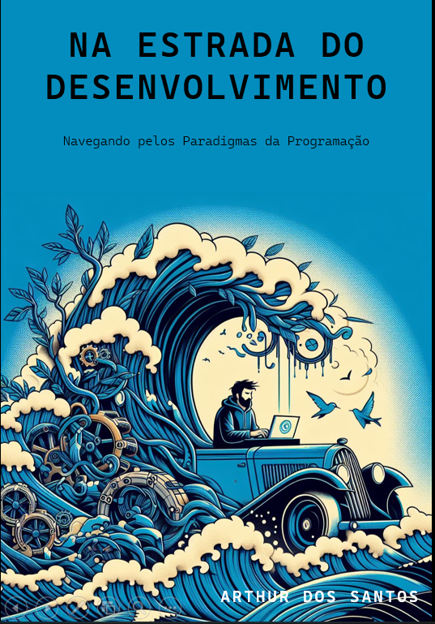

    

# Projeto Ebook gerado por IA's

> i **NOTE**: O projeto a seguir foi desenvolvido durante o BOOTCAMP "Santander 2024 - Fundamentos de IA para Devs" promovido pela Digital Innovation One (DIO).

## Prompts usados

ChatGPT:

|  Ação  | Prompt |
| :----: | ------ |
|  Tema  | Faça um lista em tópicos listando os atuais paradigmas da programação |
|  Título  | Gere 5 títulos a respeito dos paradigmas da programação em geral usando como base os nados da natação olimpica |
| Conteúdo | Faça um ebook a respeito dos paradigmas da programação, destacando os principais pontos de cada paradigma e com exemplos simples de códigos. {REGRAS} Faça um texto simples Gere um titulo sugestivo para cada seção quando necessário Por ser um ebook nao gere texto longos |

Copilot:

|  Ação  | Prompt |
| :----: | ------ |
| Titulo | Gere uma imagem criativa a respeito do tema "Braçadas no Desenvolvimento: Navegando pelos Paradigmas da Programação" para ser usada como capa de um livro. |

## Features

* Conteudo gerado via ChatGPT
* Imagem gerada via Copilot